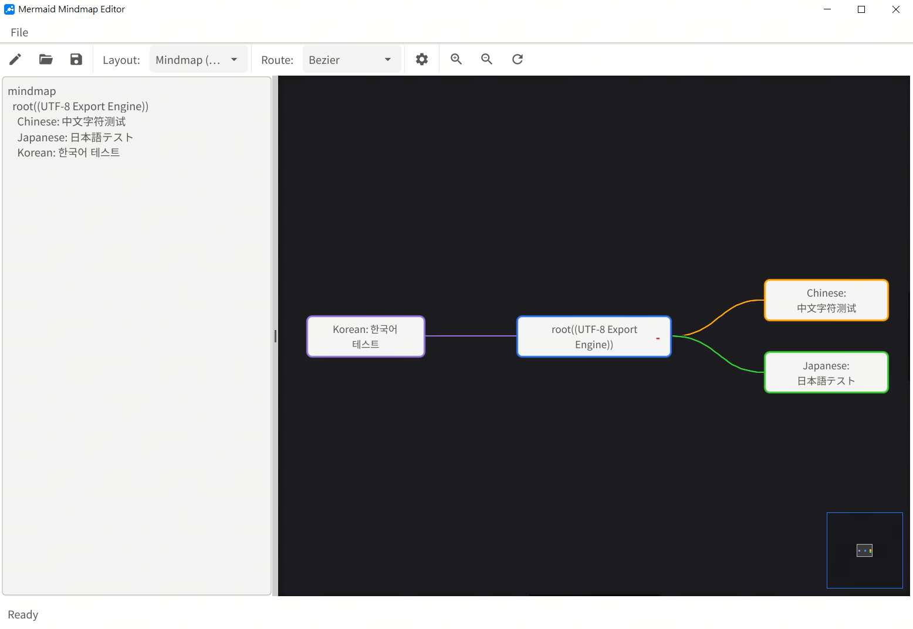
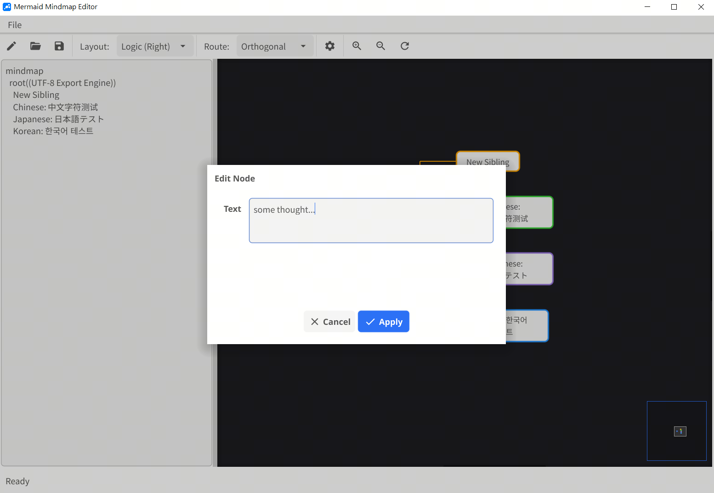
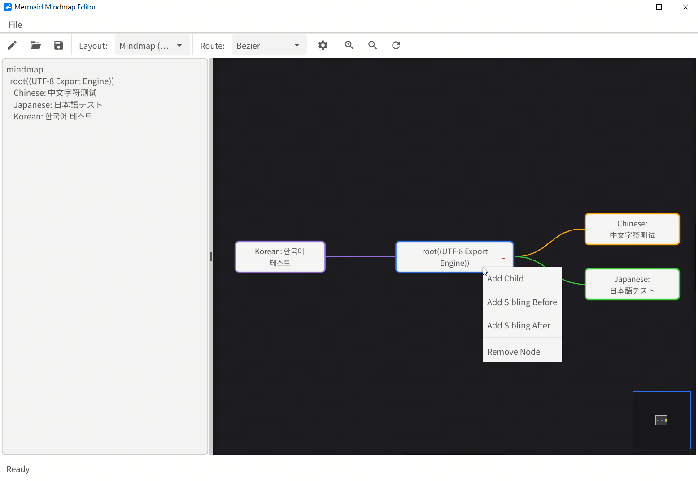

Mermaid Mindmap GUI Editor
==========================

A powerful, interactive GUI editor for Mermaid-style mindmaps, built with Go and Fyne.



Supported Features
------------------

1. Multiple Layout Modes:
   - Balanced Mindmap: Symmetrical distribution around the root.
   - Fishbone (Ishikawa): Ideal for cause-and-effect analysis.
   - Logic (Left): Hierarchy extending to the left.
   - Logic (Right): Hierarchy extending to the right.

2. Customizable Route Styles:
   - Bezier: Smooth, elegant cubic curves (S-curves).
   - Oval: Arced connections for a modern, rounded look.
   - Orthogonal: Clean, right-angled stepwise lines.

3. Visual Customization (via Settings):
   - Adjustable Line Thickness (1px - 10px).
   - Adjustable Node Padding (5px - 50px).
   - Automatic "Halo" rendering to ensure route visibility over node boundaries.

4. Interactive Canvas:
   - Real-time Preview: See changes instantly as you type.
   - Node Collapsing: Toggle branches using the "+" and "-" icons.
   - Zooming: Fluid Zoom In and Zoom Out support.
   - Mini-Map: Quick navigation for large diagrams (bottom-right).
   - Auto-Centering: One-click "Refresh & Center" to reset the view.

5. Visual Editing & Context Menus:
   - **Right-Click Context Menu**: Quickly add children, siblings, or remove nodes directly from the canvas.
   - **Direct Node Editing**: Click on any node to open a rich text editor for that node's content.




6. Export Options:
   - Export as PNG: High-quality image export with a print-friendly white background.

7. Enhanced Unicode & CJK Support:
   - Portability: Now uses bundled Noto Sans CJK KR fonts (no system fonts required).
   - Fixed Symbol Mapping: Backslash (\) is correctly rendered in both GUI and exported images (preventing legacy Won symbol ₩ mapping).
   - Improved Layout: Optimized vertical alignment and node padding for tall Asian characters.

8. Smart File Handling & Path Entry:
   - Manual Path Entry: New dialogs for Open, Save, and Export allow for direct absolute path input or browsing.
   - Consistent Paths: File dialogs default to the application's executable directory.
   - Path Sanitization: Automatic conversion of path separators and Won symbols for consistent display across all platforms.


How to Use
----------

1. Launching the Application:
   - Run via Go: `go run main.go bundled.go icon_bundled.go`
   - Or execute the compiled binary: `./mermaid-md-gui` (Linux) or `mermaid-md-gui.exe` (Windows).

2. Editing the Mindmap:
   - Type your mindmap structure in the left text panel.
   - Use indentation (spaces or tabs) to define hierarchy.

   Example Syntax:
   ```mermaid
   mindmap
     root((Root Node))
       Branch A
         Sub-branch 1
         Sub-branch 2
       Branch B
         Sub-branch 3
   ```

3. Using the Toolbar:
   - Layout Select: Switch between Balanced, Fishbone, and Logic modes.
   - Route Select: Change the connection line style (Bezier/Oval/Orthogonal).
   - Settings: Open the sliders to adjust line thickness and padding.
   - Refresh: Reset the canvas position and re-calculate the layout.

4. Exporting:
   - Go to "File" -> "Export as PNG" to save your diagram.

5. UI Scaling (FYNE_SCALE):
   If the automatic scaling detection does not suit your needs, you can manually override the interface size using the `FYNE_SCALE` environment variable.

   - **Linux / macOS**:
     ```bash
     FYNE_SCALE=1.5 ./mermaid-md-gui
     ```
   - **Windows (Command Prompt)**:
     ```cmd
     set FYNE_SCALE=1.5
     mermaid-md-gui.exe
     ```
   - **Windows (PowerShell)**:
     ```powershell
     $env:FYNE_SCALE = "1.5"
     .\mermaid-md-gui.exe
     ```
   *Note: A value of 1.0 is standard; 2.0 is double size; 0.5 is half size.*


System Requirements
-------------------
- Operating System: Windows, Linux, or macOS.
- Dependencies: Requires a C compiler (gcc) for Fyne/Go compilation.
- Font Prerequisites: `NotoSansCJKkr-Regular.otf` and `NotoSansCJKkr-Bold.otf` (Required by `bundled.go`).
  Retrieve them via:
  ```bash
  wget https://github.com/googlefonts/noto-cjk/raw/main/Sans/OTF/Korean/NotoSansCJKkr-Bold.otf
  wget https://github.com/googlefonts/noto-cjk/raw/main/Sans/OTF/Korean/NotoSansCJKkr-Regular.otf
  ```

Build Instructions
------------------

IMPORTANT: Always include `bundled.go` and `icon_bundled.go` in the build command to ensure asset support.

### 1. Linux (WSL/Native)
   - Prerequisites: `gcc`, `libgl1-mesa-dev`, `xorg-dev`.
   - Command:
     ```bash
     NPROC=$(nproc); GOMAX=$((NPROC > 2 ? NPROC - 2 : 1)); \
     go build -v -p $GOMAX -o mermaid-md-gui main.go bundled.go icon_bundled.go
     ```

### 2. Windows (Native)
   - Prerequisites: `gcc` (MinGW-w64).
   - Command:
     ```cmd
     go build -v -ldflags "-s -w -H windowsgui" -o mermaid-md-gui.exe main.go bundled.go icon_bundled.go
     ```

### 3. macOS
   - Prerequisites: `Xcode` or Command Line Tools.
   - Command (Intel/Apple Silicon):
     ```bash
     go build -v -o mermaid-md-gui-mac main.go bundled.go icon_bundled.go
     ```

### 4. Windows (Cross-Compilation from WSL/Linux)
   - Prerequisite: `x86_64-w64-mingw32-gcc`.
   - Command:
     ```bash
     GOOS=windows GOARCH=amd64 CGO_ENABLED=1 CC=x86_64-w64-mingw32-gcc \
     go build -v -ldflags="-s -w -extldflags=-static -H=windowsgui" \
     -o mermaid-md-gui.exe main.go bundled.go icon_bundled.go
     ```
